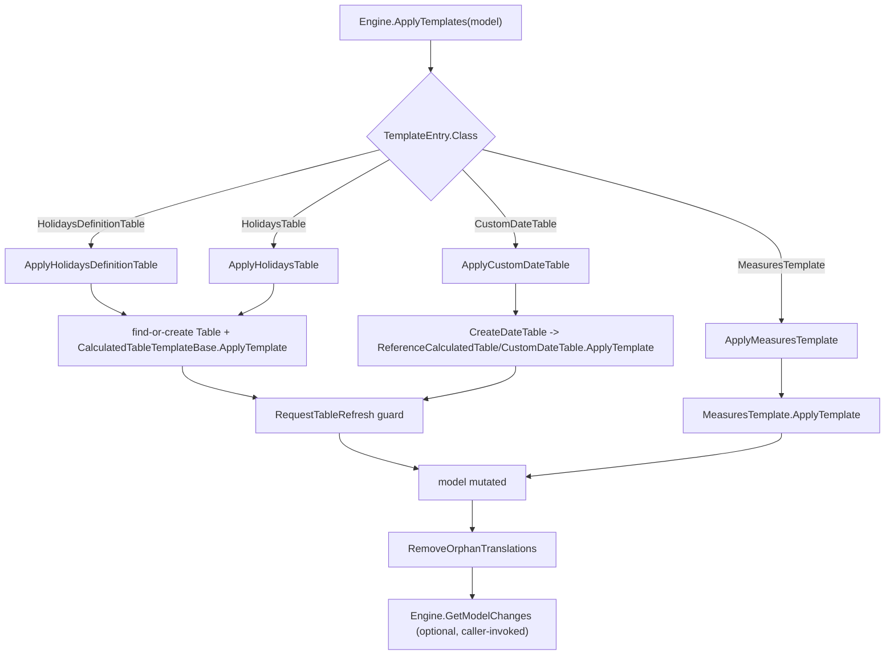

# Apply-templates lifecycle

Entry point: `Engine.ApplyTemplates` in [src/Dax.Template/Engine.cs](../../src/Dax.Template/Engine.cs).

## Construction

- `new Engine(package)` immediately calls `ApplyConfigurationDefaults()`, which fills in default values for every optional `TemplateConfiguration` property the various interfaces expect (`Configuration.Templates`, `LocalizationFiles`, `OnlyTablesColumns`/`ExceptTablesColumns`, holiday defaults, auto-naming defaults, etc.), so downstream code never has to null-check them.
- As part of the defaults, every template's `Table` and `ReferenceTable` name is added to `ExceptTablesColumns`, so auto-scan (see [domain-model-and-conventions.md](domain-model-and-conventions.md)) never scans a table that a template itself generates.

## Dispatch

`ApplyTemplates(model)` walks `Configuration.Templates[]` (each a `ITemplates.TemplateEntry`) and dispatches by the entry's `Class` string to a local handler function:

| `Class` | Handler | Template type constructed |
|---|---|---|
| `HolidaysDefinitionTable` | `ApplyHolidaysDefinitionTable` | `Tables/Dates/HolidaysDefinitionTable` |
| `HolidaysTable` | `ApplyHolidaysTable` | `Tables/Dates/HolidaysTable` |
| `CustomDateTable` | `ApplyCustomDateTable` | `Tables/Dates/CustomDateTable` (via `CreateDateTable`) |
| `MeasuresTemplate` | `ApplyMeasuresTemplate` | `Measures/MeasuresTemplate` |

An unrecognized `Class` value throws (`.First(c => c.className == template.Class)` with no match).

## Per-entry behavior

- **`HolidaysDefinitionTable` / `HolidaysTable`**: find-or-create the target `Table` by `TemplateEntry.Table`; if `IsEnabled == false`, remove the table (and disable `Configuration.HolidaysReference`) instead of applying anything.
  Otherwise construct the template type and call its `ApplyTemplate(table, isHidden, cancellationToken)`, then `RequestTableRefresh`.
- **`CustomDateTable`**: optionally creates a hidden `ReferenceTable` first (shared/reused DAX expression for multiple visible date tables), then the visible date table itself, both via the private `CreateDateTable` helper, which instantiates `Tables/Dates/CustomDateTable` and applies it.
- **`MeasuresTemplate`**: reads a `MeasuresTemplateDefinition` from JSON and calls `MeasuresTemplate.ApplyTemplate(model, isEnabled, cancellationToken)` — see [measures.md](measures.md).
- After all entries are applied, `RemoveOrphanTranslations` (local function) removes culture `ObjectTranslations` pointing at removed objects, and removes `model.Relationships` that reference a removed table or column.

## Refresh guard

`Engine.RequestTableRefresh(table)` only calls `table.RequestRefresh(RefreshType.Full)` when `table.Model?.Server != null`.
A disconnected (in-memory, offline) model has no `Server` and would throw if asked to refresh, so this guard is what allows the same code path to run unchanged against both a live server and the offline golden-file test fixtures.

## Computing a diff: `GetModelChanges`

`Engine.GetModelChanges(model)` is a **static** method, independent of `ApplyTemplates`.
When `model.HasLocalChanges`, it walks the TOM transaction log — `TxManager` → `CurrentSavepoint` → `AllBodies` — reached via `Extensions/ReflectionHelper.cs` because those members are internal to the TOM library.
For each changed `Table`/`Measure`/`Column`/`Hierarchy` it records an add/modify/remove into a `Model.ModelChanges` result (`RemovedObjects`, `ModifiedObjects`), then calls `ModelChanges.SimplifyRemovedObjects` to collapse redundant entries (e.g. a removed column on a removed table).
This is how a caller can present "what would/did this template change" without re-deriving it from the template definitions.
