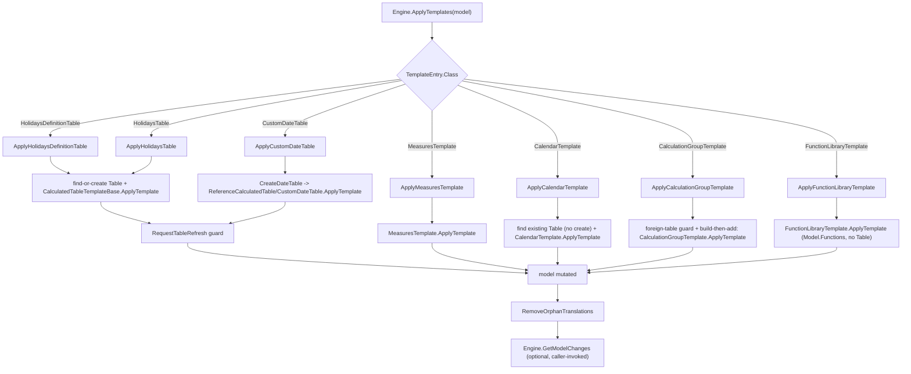

# Apply-templates lifecycle

Entry point: `Engine.ApplyTemplates` in [src/Dax.Template/Engine.cs](../../src/Dax.Template/Engine.cs).

## Construction

- `new Engine(package)` immediately calls `ApplyConfigurationDefaults()`, which fills in default values for every optional `TemplateConfiguration` property the various interfaces expect (`Configuration.Templates`, `LocalizationFiles`, `OnlyTablesColumns`/`ExceptTablesColumns`, holiday defaults, auto-naming defaults, etc.), so downstream code never has to null-check them.
- As part of the defaults, every template's `Table` and `ReferenceTable` name is added to `ExceptTablesColumns`, so auto-scan (see [domain-model-and-conventions.md](domain-model-and-conventions.md)) never scans a table that a template itself generates.

## Dispatch

`ApplyTemplates(model)` walks `Configuration.Templates[]` (each a `ITemplates.TemplateEntry`) and dispatches by the entry's `Class` string to a local handler function:

| `Class` | Handler | Template type constructed |
|---|---|---|
| `HolidaysDefinitionTable` | `ApplyHolidaysDefinitionTable` | `Tables/Dates/HolidaysDefinitionTable` |
| `HolidaysTable` | `ApplyHolidaysTable` | `Tables/Dates/HolidaysTable` |
| `CustomDateTable` | `ApplyCustomDateTable` | `Tables/Dates/CustomDateTable` (via `CreateDateTable`) |
| `MeasuresTemplate` | `ApplyMeasuresTemplate` | `Measures/MeasuresTemplate` |
| `CalendarTemplate` | `ApplyCalendarTemplate` | `Tables/Calendars/CalendarTemplate` |
| `CalculationGroupTemplate` | `ApplyCalculationGroupTemplate` | `Tables/CalculationGroups/CalculationGroupTemplate` |
| `FunctionLibraryTemplate` | `ApplyFunctionLibraryTemplate` | `Functions/FunctionLibraryTemplate` |

An unrecognized `Class` value throws (`.First(c => c.className == template.Class)` with no match).

## Per-entry behavior

- **`HolidaysDefinitionTable` / `HolidaysTable`**: find the target `Table` by `TemplateEntry.Table` (without creating it yet). If `IsEnabled == false`, remove the table if it exists (and disable `Configuration.HolidaysReference`) instead of applying anything.
  Otherwise validate the entry first — `HolidaysDefinitionTable` requires a non-blank `TemplateEntry.Template`, throwing `InvalidConfigurationException` otherwise — **before** creating the table, so an invalid/empty `Template` no longer leaves a phantom empty table in the model. Only then find-or-create the table, construct the template type, call its `ApplyTemplate(table, isHidden, cancellationToken)`, and `RequestTableRefresh`.
- **`CustomDateTable`**: validates `TemplateEntry.Template` and `TemplateEntry.Table` are non-blank (`InvalidConfigurationException` otherwise). If `IsEnabled == false`, removes the previously-created date table (`TemplateEntry.Table`) and, if configured, its reference table (`TemplateEntry.ReferenceTable`) — symmetric with the `HolidaysDefinitionTable`/`HolidaysTable` handling above (previously a disabled entry left both tables in the model). Otherwise it optionally creates a hidden `ReferenceTable` first (shared/reused DAX expression for multiple visible date tables), then the visible date table itself, both via the private `CreateDateTable` helper, which instantiates `Tables/Dates/CustomDateTable` and applies it.
- **`MeasuresTemplate`**: reads a `MeasuresTemplateDefinition` from JSON and calls `MeasuresTemplate.ApplyTemplate(model, isEnabled, cancellationToken)` — see [measures.md](measures.md).
- **`CalendarTemplate`**: validates `TemplateEntry.Table` and `TemplateEntry.Template` are non-blank (`InvalidConfigurationException` otherwise), then, unlike every other handler, **finds but never creates** the target table — `model.Tables.Find(TemplateEntry.Table)`. When `IsEnabled == true` it throws `TemplateException` if the table doesn't already exist (a calendar has nothing to attach to on its own); when `IsEnabled == false` a missing target table is a silent no-op (nothing to disable), matching the disabled-path behavior of the sibling handlers. It reads a `CalendarTemplateDefinition` from `TemplateEntry.Template` and calls `CalendarTemplate.ApplyTemplate(targetTable, isEnabled, cancellationToken)` — see [table-generation.md](table-generation.md#calendars) for the column-group schema, the compatibility-level guard, and the `Calendar.Name` idempotency model. No `RequestTableRefresh` is issued (attaching a calendar doesn't change the table's row/column shape).
- **`CalculationGroupTemplate`**: validates `TemplateEntry.Table` is non-blank, then looks up an existing table by that name. If `IsEnabled == false`, removes the existing table (if any) and returns — a missing table is a silent no-op. Otherwise validates `TemplateEntry.Template` is non-blank, then applies a **foreign-table guard**: if a table with that name already exists and is not tagged with the `SQLBI_Template = "CalculationGroup"` annotation, it throws `TemplateException` rather than overwriting a user's unrelated table. It reads a `CalculationGroupTemplateDefinition` from `TemplateEntry.Template` and calls `CalculationGroupTemplate.ApplyTemplate(table, isHidden, cancellationToken)` against either the existing table or a brand-new, not-yet-attached `Table` instance — see [table-generation.md](table-generation.md#calculation-groups) for the calculation-item schema, the compatibility-level requirements, and the annotation-keyed idempotency model. For a brand-new table, the `Table` is only added to `model.Tables` (and stamped with a `LineageTag`) **after** `ApplyTemplate` returns successfully (build-then-add), so an invalid definition never leaves a phantom table in the model. No `RequestTableRefresh` is issued (calculation items are pure metadata; the `CalculationGroupSource` partition has no query to refresh).
- **`FunctionLibraryTemplate`**: validates `TemplateEntry.Template` is non-blank (`InvalidConfigurationException` otherwise), reads a `FunctionLibraryTemplateDefinition` from it, and calls `FunctionLibraryTemplate.ApplyTemplate(model, isEnabled, cancellationToken)` — see [functions.md](functions.md) for the DAX user-defined-function (UDF) JSON schema, the compatibility-level guard, and the annotation-keyed idempotency model. Unlike every other handler, this one is **model-level**: it never looks up or creates a `Table` (`TemplateEntry.Table` is unused), so there is no find-or-create step and no `RequestTableRefresh` call — functions are created, updated, and reconciled directly on `Model.Functions`.
- After all entries are applied, `RemoveOrphanTranslations` (local function) removes culture `ObjectTranslations` pointing at removed objects, and removes `model.Relationships` that reference a removed table or column.

## Refresh guard

`Engine.RequestTableRefresh(table)` only calls `table.RequestRefresh(RefreshType.Full)` when `table.Model?.Server != null`.
A disconnected (in-memory, offline) model has no `Server` and would throw if asked to refresh, so this guard is what allows the same code path to run unchanged against both a live server and the offline golden-file test fixtures.

## Computing a diff: `GetModelChanges`

`Engine.GetModelChanges(model)` is a **static** method, independent of `ApplyTemplates`.
When `model.HasLocalChanges`, it walks the TOM transaction log — `TxManager` → `CurrentSavepoint` → `AllBodies` — reached via `Extensions/ReflectionHelper.cs` because those members are internal to the TOM library.
For each changed `Table`/`Measure`/`Column`/`Hierarchy` it records an add/modify/remove into a `Model.ModelChanges` result (`RemovedObjects`, `ModifiedObjects`), then calls `ModelChanges.SimplifyRemovedObjects` to collapse redundant entries (e.g. a removed column on a removed table).
This is how a caller can present "what would/did this template change" without re-deriving it from the template definitions.

`GetModelChanges` only inspects the transaction log when `model.HasLocalChanges` is `true`, which TOM only sets on a server-connected model. Calling `GetModelChanges` after applying templates to a disconnected/offline model (as built for the offline test harness) returns an empty `ModelChanges` even though the in-memory model was visibly changed — it is only meaningful against a server-connected model.
